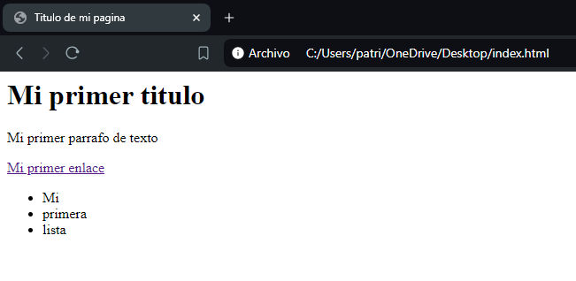
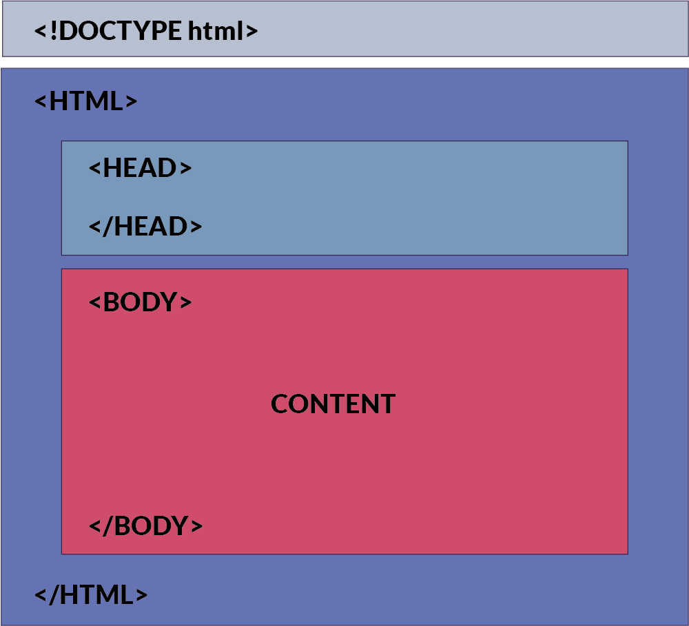

# ¿Qué es HTML?

El HTML por sus siglas (Hyper Text Markup Language) o en español, lenguaje de marcado de hipertexto es el lenguaje de marcado estándar para crear sitios webs. Este mismo describe la estructura que tendrá tu sitio web en el navegador, utilizando diferentes elementos como por ejemplo títulos, párrafos, enlaces, listas, entre otros.

## Ejemplo simple y básico de un documento HTML

```html
<!DOCTYPE html>
<html>
<head>
	<title>Titulo de mi pagina</title>
</head>
<body>
	<h1>Mi primer titulo</h1>
	<p>Mi primer parrafo de texto</p>
	<a href="https://github.com/patrickwebsdev">Mi primer enlace</a>
	<ul>
		<li>Mi</li>
		<li>primera</li>
		<li>lista</li>
	</ul>
</body>
</html>
```

## Explicación de el ejemplo

- La linea `<!DOCTYPE html>` define que el tipo de documento es `HTML`
- El elemento `<html>` define que es el elemento raíz de la pagina web, la cual contendrá todo nuestro sitio (scripts, metadatos, cuerpo de la pagina, estilos, etc)
- El elemento `<head>` contiene la metainformación de el sitio web
- El elemento `<title>` especifica el titulo del sitio web, este será mostrado en la pestaña de la barra de navegación de nuestro navegador web.
- El elemento `<body>` define el cuerpo del documento y es un contenedor para todo el contenido de nuestro sitio web (títulos, párrafos, enlaces, listas, imágenes, tablas, etc)
- El elemento `<h1>` define un encabezado de pagina
- El elemento `<p>` define un párrafo de pagina
- El elemento `<ul>` define una lista de elementos
- El elemento `<li>` define un elemento dentro de una lista

## ¿Qué es un elemento HTML?

Estuvimos hablando mucho sobre elementos `h1`, `p`, `ul`, `li`, pero, ¿Qué es un elemento dentro de HTML?

Un elemento HTML esta conformado por etiqueta de inicio, contenido y etiqueta de cierre (Esta se identifica por contener un `/` antes del nombre de la etiqueta).


| Etiqueta de inicio | Contenido         | Etiqueta de cierre |
| ------------------ | ----------------- | ------------------ |
| `<h1>`             | Mi primer titulo  | `</h1>`            |
| `<p>`              | Mi primer parrafo | `</p>`             |

## Navegadores

La función de los navegadores es leer documentos HTML y mostrarlos correctamente. El mismo no muestra las etiquetas HTML, las utilizan para definir como mostrar el contenido del documento.



> [!NOTE]
> El contenido de la sección `<body>` se mostrará en un navegador. El contenido dentro del elemento `<title>` se mostrará en la barra de título del navegador o en la pestaña de la página.

## Estructura de la pagina en HTML

Visualización de la estructura de una pagina HTML

