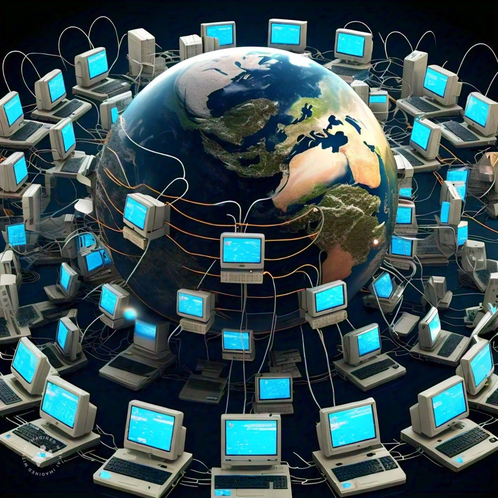
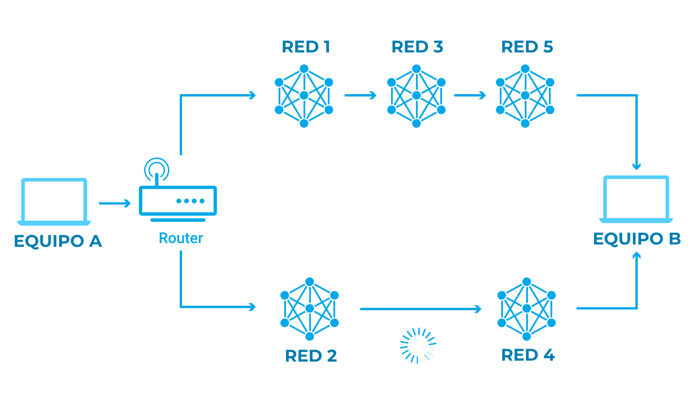

# Empecemos por el inicio, ¿Qué es el internet?

El internet es una red de computadoras que están conectadas entre si por medio de un protocolo estandarizado que les permite comunicarse.

--------------------------------------------------

# Cable y Wi-Fi

La forma en la que las computadoras se comunican es en formato de bits a través de diversos métodos, entre ellos están cables Ethernet, fibra óptica o señales inalámbricas (Wi-FI).

--------------------------------------------------

# Que son los bits

Los bits corresponden a un dígito del sistema de numeración binario que puede estar conformado por 0 o 1 y es la unidad mínima de información.
El nombre viene por una abreviación de "binary digit" o "dígito binario"

# Paquetes y enrutamiento

### ¿Que es un paquete de datos?

Un paquete de datos es un pequeño segmento de un mensaje mas grande. Los datos enviados a través de la red se dividen en pequeños paquetes, los cuales al llegar al equipo destinado, estos se vuelven a combinar.
Por eso cuando estamos descargando un archivo muy grande, algunas veces el nombre del archivo es del estilo "Sin confirmar 12345.crdownload" (Esto en navegadores basados en chromium) ya que el mismo aun no se termina de descargar y no se puede terminar de combinar.

### ¿Que es el enrutamiento?

Es un proceso de selección de rutas a través de una o mas redes.
Esas tareas las realizan unos dispositivos especiales llamados enrutadores.

En la siguiente imagen veremos un equipo A y un equipo B, el equipo A le quiere enviar un archivo al equipo B, ¿Debería pasar por las redes 1, 3 y 5, o por las redes 2 y 4?

Los paquetes de datos del archivo tendrán un camino mas corto por las redes 2 y 4, pero puede que las redes 1, 3 y 5 sean mas rápidas en el reenvió de paquetes que las 2 y 4.

Esta clase de decisiones las tiene que tomar los enrutadores de red.

