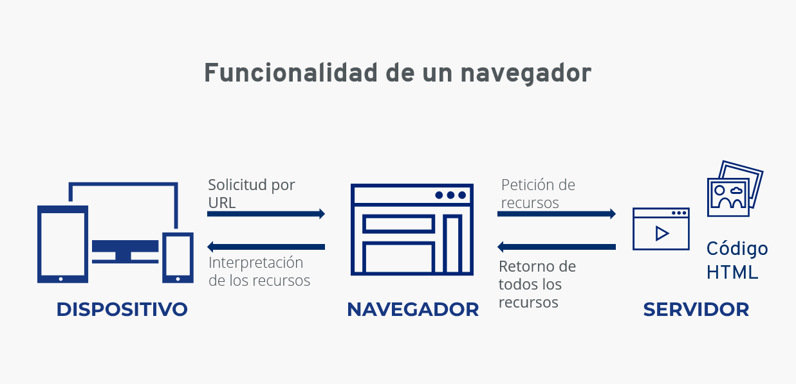

# ¿Qué es un navegador?

Un navegador es una aplicación la cual te permite acceder a los sitios web, interpretando diferentes tipos de archivos para que estos puedan ser vistos.

### Navegadores web
Entre ellos están:
- Brave
- Google Chrome
- Mozilla Firefox
- Microsoft Edge
- Opera
- Safari

Estos son los mas comunes y la mayoría están basados en chromium, un proyecto creado por google el cual ya hace un tiempo es de código abierto, utilizan este mismo para su navegador Google Chrome.

## ¿Como funciona un navegador?

Los navegadores envían y reciben información por la web a través del protocolo [HTTP](./Que-es-HTTP.md).

Para pintar la información en los navegadores utilizan una interfaz de usuario que contiene botones, imágenes y demás elementos, el cual es denominado frontend.

Por otro lado, los navegadores para enviar y recibir datos tienen un lado menos visible el cual se denomina backend, el cual esta conformado por ciertos servicios, como servidores, base de datos, cdn's, entre otros.

