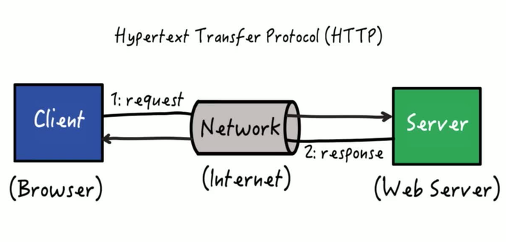

# ¿Que es el protocolo HTTP? (Hyper Text Transfer Protocolo)

El HTTP es el protocolo por el cual se transmite el HTML (Hyper Text Markup Lenguage), los navegadores web utilizan este protocolo para solicitar las paginas webs que visitamos a los servidores.

## ¿Que es un protocolo?

Un protocolo es una serie de reglas estandarizadas con las cuales se van a comunicar dos entidades, en este caso, dos computadoras. El modelo TCP/IP (El cual utiliza HTTP) nos permite la comunicación entre computadoras.

## ¿Como funciona el protocolo HTTP?

Así como nosotros nos comunicamos a través del lenguaje, las maquinas se comunican a través de este protocolo gracias al modelo TCP/IP.

Las reglas del protocolo HTTP se definen por los "headers" que se dividen en dos grupos:

- Headers request (Peticion): Están definidos principalmente por el método de petición (GET, POST, PUT, etc), hacia donde ira el request y la información que debe enviar.
- Headers response (Respuesta): Están definidos principalmente por la respuesta del servidor y también por las características de respuesta

### Funcionamiento del protocolo HTTP

1. El cliente envía una petición
2. Se transmite por internet
3. El servidor recibe la petición
4. Genera una respuesta y la envía de nuevo al cliente
5. El cliente recibe la respuesta e interpreta lo recibido

